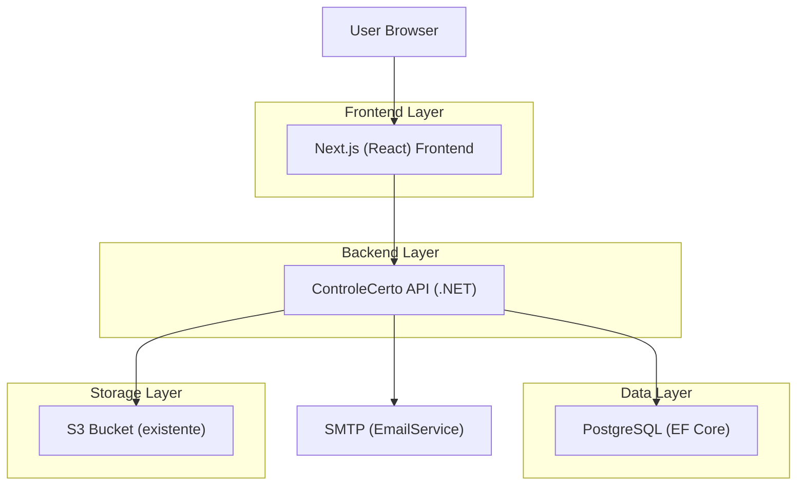
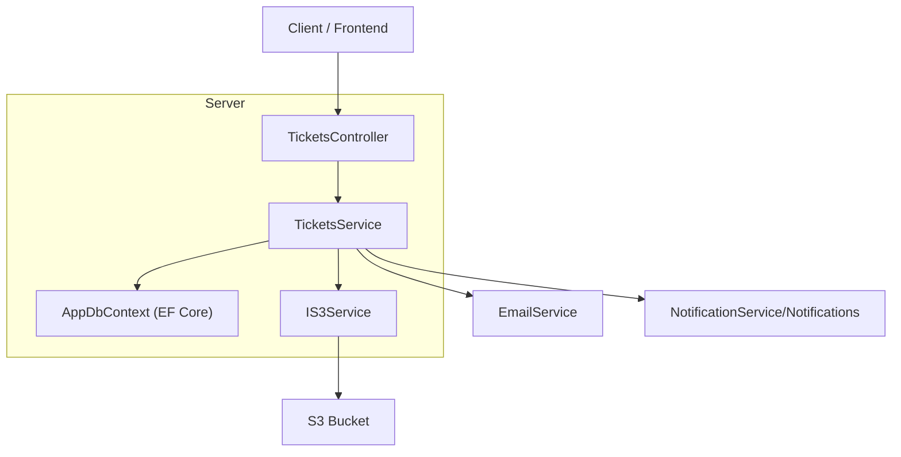
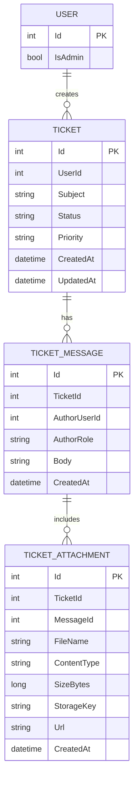

## 1.Architecture design


## 2.Technology Description
- Frontend: Next.js (React) + TypeScript + TailwindCSS + shadcn/ui (component library já presente)
- Backend: ASP.NET Core Web API + EF Core
- Storage: AWS S3 (reuso do `IS3Service`/`S3Service` e bucket configurado via `AWS:BucketName`/`AWS:BucketUrl`)
- Notificações: tabela `Notifications` existente via `NotificationService` (com `ActionPath` para deep link)
- E-mail: `EmailService` (SMTP) para avisos de atualização do chamado

## 3.Route definitions
| Route | Purpose |
|-------|---------|
| /[locale]/tickets | Área do usuário: listar e criar chamados |
| /[locale]/tickets/[id] | Detalhe do chamado: chat assíncrono + anexos |
| /[locale]/admin/tickets | Área admin: fila/triagem |
| /[locale]/admin/tickets/[id] | Área admin: detalhe/atendimento (deep link) |

## 4.API definitions (If it includes backend services)
### 4.1 Core API
**Convenção (respeitando padrão atual):** criar módulo no back em `ControleCerto.Api/Modules/Tickets/*` (Controllers/DTOs/Services) e/ou Controllers raiz, mantendo Services/Interfaces quando compartilhado.

Endpoints (REST):
- `POST /tickets` (auth): criar chamado
- `GET /tickets` (auth): listar chamados do usuário (paginação/ordenar por updatedAt)
- `GET /tickets/{id}` (auth): obter detalhe (metadados + mensagens + anexos)
- `POST /tickets/{id}/messages` (auth): enviar mensagem (com ou sem anexos)
- `POST /tickets/{id}/attachments` (auth): upload de anexo (retorna url + key; grava metadados)
- `PATCH /tickets/{id}` (auth): usuário encerrar/reabrir (regras do status)

Admin:
- `GET /admin/tickets` (admin): fila com filtros (status/prioridade)
- `PATCH /admin/tickets/{id}` (admin): alterar status/prioridade/atribuição
- `POST /admin/tickets/{id}/messages` (admin): responder

Notificações:
- Ao criar chamado/mensagem/alterar status: criar notificação interna com `ActionPath` para o front (ex.: `/pt/tickets/{id}` ou `/pt/admin/tickets/{id}`) e enviar e-mail para o outro lado.

TypeScript types (compartilháveis conceitualmente entre front e back):
```ts
export type TicketStatus = "open" | "in_progress" | "waiting_user" | "resolved" | "closed";
export type TicketPriority = "low" | "normal" | "high";

export type Ticket = {
  id: number;
  subject: string;
  status: TicketStatus;
  priority: TicketPriority;
  createdAt: string;
  updatedAt: string;
};

export type TicketMessage = {
  id: number;
  ticketId: number;
  authorUserId: number;
  authorRole: "user" | "admin";
  body: string;
  createdAt: string;
  attachments: TicketAttachment[];
};

export type TicketAttachment = {
  id: number;
  ticketId: number;
  messageId?: number;
  fileName: string;
  contentType: string;
  sizeBytes: number;
  storageKey: string;
  url: string;
  createdAt: string;
};
```

## 5.Server architecture diagram (If it includes backend services)


## 6.Data model(if applicable)
### 6.1 Data model definition


### 6.2 Data Definition Language
```sql
CREATE TABLE tickets (
  id BIGSERIAL PRIMARY KEY,
  user_id INT NOT NULL,
  subject VARCHAR(140) NOT NULL,
  status VARCHAR(30) NOT NULL,
  priority VARCHAR(20) NOT NULL,
  created_at TIMESTAMPTZ NOT NULL DEFAULT NOW(),
  updated_at TIMESTAMPTZ NOT NULL DEFAULT NOW()
);
CREATE INDEX idx_tickets_user_updated ON tickets (user_id, updated_at DESC);
CREATE INDEX idx_tickets_status_updated ON tickets (status, updated_at DESC);

CREATE TABLE ticket_messages (
  id BIGSERIAL PRIMARY KEY,
  ticket_id BIGINT NOT NULL,
  author_user_id INT NOT NULL,
  author_role VARCHAR(10) NOT NULL,
  body TEXT NOT NULL,
  created_at TIMESTAMPTZ NOT NULL DEFAULT NOW()
);
CREATE INDEX idx_ticket_messages_ticket_created ON ticket_messages (ticket_id, created_at);

CREATE TABLE ticket_attachments (
  id BIGSERIAL PRIMARY KEY,
  ticket_id BIGINT NOT NULL,
  message_id BIGINT NULL,
  file_name VARCHAR(255) NOT NULL,
  content_type VARCHAR(120) NOT NULL,
  size_bytes BIGINT NOT NULL,
  storage_key VARCHAR(500) NOT NULL,
  url VARCHAR(800) NOT NULL,
  created_at TIMESTAMPTZ NOT NULL DEFAULT NOW()
);
CREATE INDEX idx_ticket_attachments_ticket ON ticket_attachments (ticket_id);
CREATE INDEX idx_ticket_attachments_message ON ticket_attachments (message_id);
```

**Notas de implementação (alinhado ao seu repositório):**
- Back: criar Entities + MapConfig em `Models/Entities` e `Models/MapConfig`; criar módulo `Modules/Tickets/{Controllers,DTOs,Services}` no mesmo padrão do `Modules/Dashboard`.
- Upload: usar `IS3Service.UploadFileAsync(file, key)` e persistir `storageKey` + `url`; formato de key sugerido: `tickets/{ticketId}/{guid}_{fileName}`.
- Front: criar `src/modules/tickets/*` (services/hooks/context/types/components) e rotas em `src/app/[locale]/tickets/*` + `src/app/[locale]/admin/tickets/*`.
