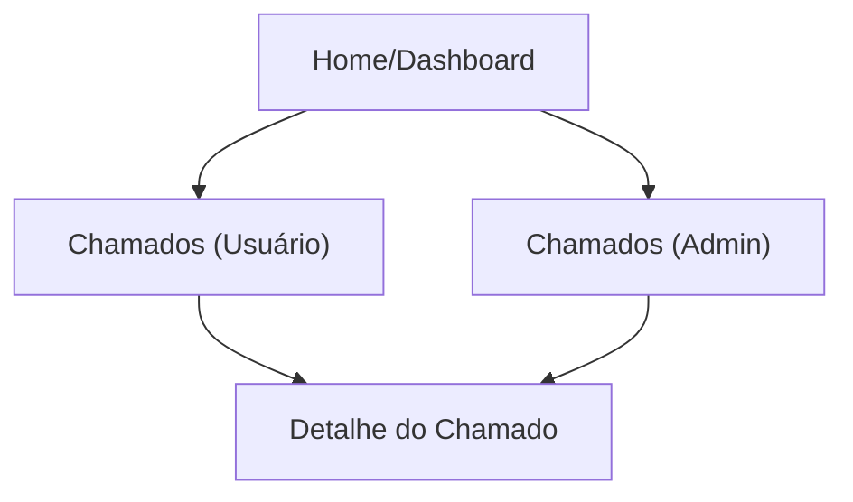

## 1. Product Overview
Módulo de Chamados/Ajuda para você abrir solicitações, anexar arquivos em bucket existente e conversar de forma assíncrona com o time/admin.
Inclui um painel de triagem para admin, com histórico e status do atendimento.

## 2. Core Features

### 2.1 User Roles
| Role | Registration Method | Core Permissions |
|------|---------------------|------------------|
| Usuário | Login existente (e-mail/senha) | Criar chamado, enviar mensagens/anexos, acompanhar status e histórico |
| Admin | Usuário com `IsAdmin=true` | Ver fila de chamados, responder, mudar status/prioridade, encerrar/reabrir |

### 2.2 Feature Module
1. **Chamados (Usuário)**: lista e filtros básicos, criar chamado, visualizar status.
2. **Detalhe do Chamado (Chat + Anexos)**: conversa assíncrona, anexos, timeline do atendimento.
3. **Chamados (Admin)**: fila/triagem, resposta ao usuário, mudanças de status e gestão de anexos.

### 2.3 Notificações
- **Notificação interna**: sempre que houver nova mensagem ou mudança de status, o outro lado recebe uma notificação no sistema com link direto para o chamado.
- **E-mail**: mesmas situações da notificação interna, enviando um e-mail com link direto para o chamado.
- **Eventos que disparam**:
  - Chamado criado (notificar admins)
  - Mensagem do usuário (notificar admins)
  - Mensagem do admin (notificar usuário)
  - Status alterado (notificar o outro lado)

### 2.4 Page Details
| Page Name | Module Name | Feature description |
|-----------|-------------|---------------------|
| Chamados (Usuário) | Lista de chamados | Exibir chamados do usuário com status, data, assunto; permitir buscar/filtrar por status e ordenar por atualização. |
| Chamados (Usuário) | Criar chamado | Criar chamado com assunto, categoria (opcional), descrição inicial; anexar arquivos; confirmar criação e redirecionar ao detalhe. |
| Detalhe do Chamado | Conversa assíncrona | Exibir mensagens em ordem cronológica; enviar nova mensagem; indicar “aguardando resposta” e última atualização. |
| Detalhe do Chamado | Anexos | Fazer upload de anexos no bucket existente via API; listar anexos por mensagem; permitir download/visualização. |
| Detalhe do Chamado | Status do chamado | Exibir status atual; permitir usuário encerrar (quando aplicável) e reabrir (se permitido). |
| Chamados (Admin) | Fila/triagem | Exibir fila com filtros (status/prioridade), busca por usuário/assunto; abrir detalhe do chamado. |
| Chamados (Admin) | Atendimento | Enviar resposta; alterar status (aberto/em atendimento/aguardando usuário/resolvido/fechado); ajustar prioridade; registrar auditoria mínima (data/autor). |
| Notificações | Notificação interna | Criar notificação no sistema com link direto ao chamado quando houver atualização relevante. |
| Notificações | E-mail | Enviar e-mail com link direto ao chamado quando houver atualização relevante. |

## 3. Core Process
**Fluxo do Usuário**
1. Você acessa “Chamados” pelo menu.
2. Você cria um chamado com descrição e anexos.
3. Você acompanha o andamento no detalhe, enviando mensagens quando necessário.
4. Você encerra o chamado quando resolvido (ou reabre, se permitido).

**Fluxo do Admin**
1. Você acessa “Chamados (Admin)” e visualiza a fila.
2. Você abre um chamado, responde e ajusta status/prioridade.
3. Você encerra o chamado quando resolvido, mantendo histórico e anexos.

